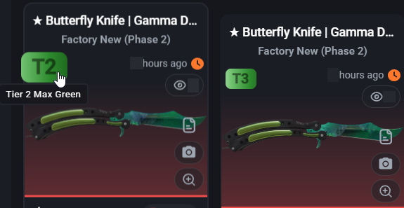
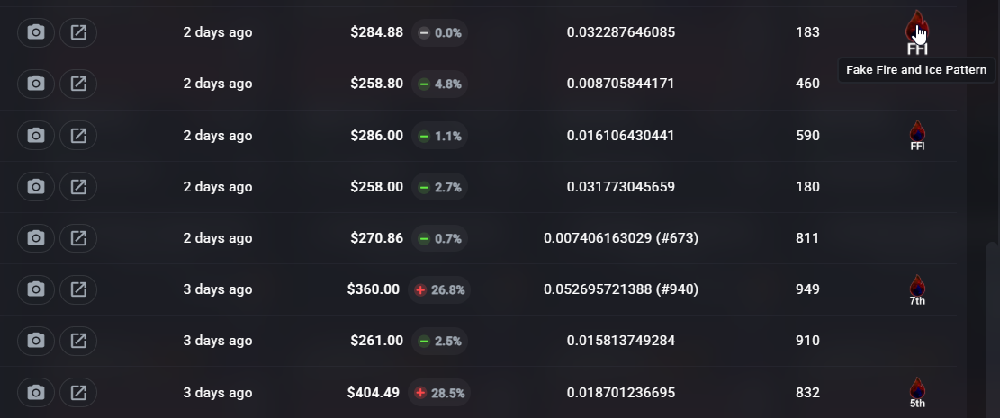

# More CSFloat Badges

  
  
  
  
  
  
  
  
  
  
  
  

A browser extension that adds patterns-based ranked badges for [CSFloat's](https://csfloat.com) listings and sales history, extending coverage for some Marble Fade knives from tiers **4th through Fake** - beyond the built-in 1st–3rd tiers badges. Also adds ranking badges for Specialist Gloves | Fade. Changes history columns a little for items custom badges are injecting for.

Work for all **/listings** (small cards), **/item** item detail (big card) and **Latest Sales** rows.

## 🔍 Preview 

<table>
  <tr>
    <td align="center">
       
      Listings page
    </td>
    <td align="center">
       
      Item detail
    </td>
  </tr>
  <tr>
    <td align="center" colspan="2">
       
      Sales history
    </td>
  </tr>
</table>

## 🛠️ Install:

1. Download from the latest extension `.zip` from [Releases page](https://github.com/cyberbebebe/more-csfloat-badges/releases)
2. Unzip the archive to a folder on your computer
3. Open Chromium-based browser (Chrome, Brave, Edge, Opera, etc.):
   - Go to `chrome://extensions/` (or usually "Menu -> Extensions -> Manage Extensions").
   - Enable **Developer mode** (toggle in the top right corner).
   - Click **Load unpacked**.
   - Select the folder where you unzipped the extension.
4. Reload the CSFloat page

## Pattern sources

| Weapon            | Skin        | Sources                                                                                                                                                                                     |
| ----------------- | ----------- | ------------------------------------------------------------------------------------------------------------------------------------------------------------------------------------------- |
| Karambit          | Marble Fade | [korenevskiy's guide](https://steamcommunity.com/sharedfiles/filedetails/?id=2948050515) / [csgoskins article](https://csgoskins.gg/blog/karambit-marble-fade-fire-and-ice-seed-patterns)   |
| Talon Knife       | Marble Fade | [korenevskiy's guide](https://steamcommunity.com/sharedfiles/filedetails/?id=3137093565) /                                                                                                  |
| Bayonet           | Marble Fade | [korenevskiy's guide](https://steamcommunity.com/sharedfiles/filedetails/?id=3137149490) / [csgoskins article](https://csgoskins.gg/blog/bayonet-marble-fade-fire-and-ice-seed-patterns)    |
| Flip Knife        | Marble Fade | [korenevskiy's guide](https://steamcommunity.com/sharedfiles/filedetails/?id=3137162447) / [csgoskins article](https://csgoskins.gg/blog/flip-knife-marble-fade-fire-and-ice-seed-patterns) |
| Gut Knife         | Marble Fade | [korenevskiy's guide](https://steamcommunity.com/sharedfiles/filedetails/?id=3137163506) / [csgoskins article](https://csgoskins.gg/blog/gut-knife-marble-fade-fire-and-ice-seed-patterns)  |
| Specialist Gloves | Fade        | [korenevskiy's guide](https://steamcommunity.com/sharedfiles/filedetails/3304802458) /                                                                                                      |
