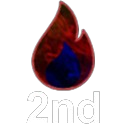
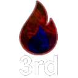
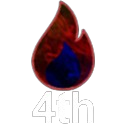
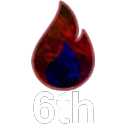
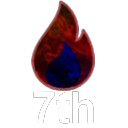
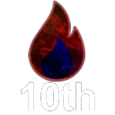
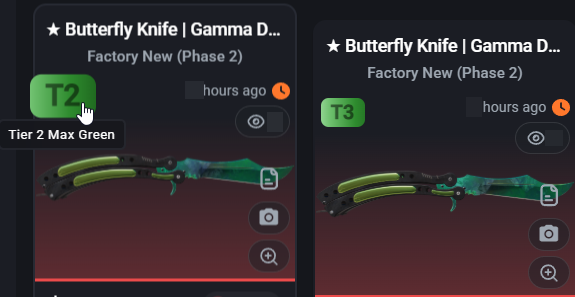
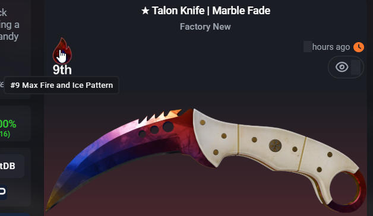
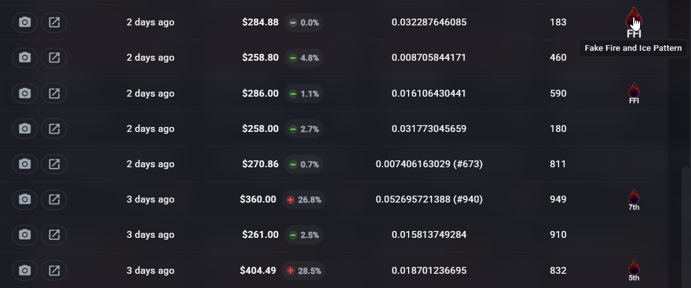

# More CSFloat Badges

  
  
  
  
  
  
  
  
  
  
  
  

## ✨ Features

A browser extension for [CSFloat](https://csfloat.com) that expands the pattern-based badge system and upgrades the Latest Sales section for maximum convenience.

1. **Comprehensive Pattern Badges:** Injects expanded tier badges directly into item cards (see screenshots below). This fills the gap left by the native CSFloat badges and the BetterFloat extension:
   - **Marble Fade Knives:**
     - From 4th Max down to Fake Fire & Ice (CSFloat has built-in badges for tiers 1-3)
     - From 1st Max down to 10th Fire & Ice for the Talon Knife (CSFloat does not have any built-in)
   - **Doppler Knives:**
     - Phase 1: Max Blue / Pink Tips, Fake Black Pearls
     - Phase 2: Max Pink ("Pink Galaxy")
     - Phase 3: Max Blue, Fake Black Pearls
     - Phase 4: Max Blue ("Fake Sapphire")
   - **Gamma Doppler Knives:**
     - Phase 1: Diamond Gem, Diamond Tip
     - Phase 2: Max Green ("Fake Emerald")
     - Phase 3: Max Cyan, Cyan Tip
     - Phase 4: Max Cyan / Lime, Cyan / Lime Tip
   - **Fade Gloves:**
     - Ranks 1st-3rd, higher than Tier 1
     - Tiers 1st-3rd and Better than average
     - Special Orange ("Mango") pattern
   - **Other items in future (other Doppler and Gamma- phases, possibly gloves).**

2. **Enhanced Sales History Table:** Why does CSFloat have such a poor Latest Sales table? This extension makes it exactly as it should have been by making the sales table a scrollable part of the details card (permanent), automatically hiding the "Stickers" column for knives (see list below), and integrating pattern badges directly into the sales rows. This makes price-checking faster, more convenient and reliable.

3. **BetterFloat Synergy:** Fully compatible with the [BetterFloat extension](https://github.com/GODrums/BetterFloat). Works exceptionally well with their "Show In-Game Pictures" feature, allowing you to **instantly compare the visual differences** between pattern tiers directly on the item cards.

> **Note:** This extension detects BetterFloat's custom badges on item listings and prefers to show **them** instead of its own. However, extension's custom badges will still appear in the Latest Sales table.

## 🔍 Preview

<table>
  <tr>
    <td align="center" width="50%">
       
      <b>Listings page</b>
    </td>
    <td align="center" width="55%">
       
      <b>Item detail</b>
    </td>
  </tr>
  <tr>
    <td align="center" colspan="2">
       
      <b>Sales history</b>
    </td>
  </tr>
</table>

## 🛠️ Install:

1. Download the latest extension `.zip` from the [Releases page](https://github.com/cyberbebebe/more-csfloat-badges/releases)
2. Unzip the archive to a folder on your computer
3. Open Chromium-based browser (Chrome, Brave, Edge, Opera, etc.):
   - Go to `chrome://extensions/` (or usually "Menu -> Extensions -> Manage Extensions").
   - Enable **Developer mode** (toggle in the top right corner).
   - Click **Load unpacked**.
   - Select the folder where you unzipped the extension.
4. Reload the CSFloat page

## Patterns sources

#### Main guide: [The Complete Skins Guide](https://steamcommunity.com/sharedfiles/filedetails/?id=1728104691) by [korenevskiy](https://steamcommunity.com/profiles/76561198248531102)

Specific guide pages used as sources for this extension (use Ctrl + LMB for links):
| Skin | Items | Source |
| --------------------- | -------------------------------------- | ---------------------------------------------------------------------------------------- |
| Marble Fade | Karambit, Bayonet, Flip, Gut, Talon | [korenevskiy's guide](https://steamcommunity.com/sharedfiles/filedetails/?id=3137170442) |
| Doppler (Phases 1, 2, 3, 4) | All knives (where available) | [korenevskiy's guide](https://steamcommunity.com/sharedfiles/filedetails/?id=3249241637) |
| Gamma Doppler (Phases 1, 2, 3) | All knives (where available) | [korenevskiy's guide](https://steamcommunity.com/sharedfiles/filedetails/?id=3284341165) |
| Fade | Specialist Gloves | [korenevskiy's guide](https://steamcommunity.com/sharedfiles/filedetails/3304802458) |

## Excluded Patterns (Fully or partially covered by BetterFloat)

To ensure perfect compatibility and avoid duplicate badges, the following patterns are intentionally left to be handled by BetterFloat:
| Skin | Patterns |
| --- | --- |
| Doppler | Max Ruby / Max Sapphire |
| Gamma Doppler | Max Emerald |
| Nocts | Max Black tiers |
| Overprint | Arrow / Flower / Mixed / Polygon patterns |
| Crimson web, Emerald web | Single / Double / Triple web tiers |
| Crimson Kimono | Max Red / Max Gray tiers |

> This list is subject to change as I'm discovering which items BetterFloat covers.

#### Created for the CS2 community and is not intended for commercial use
